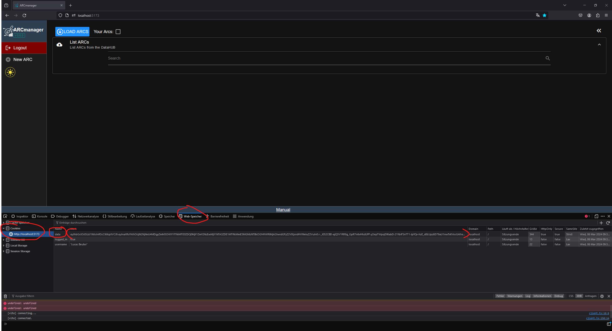
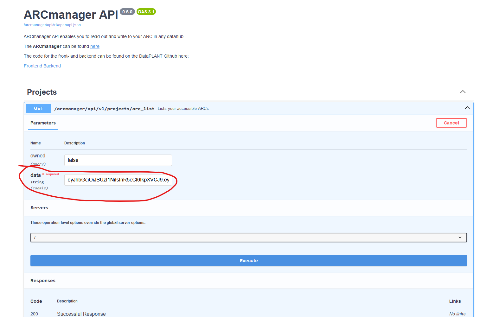

# How to retrieve the cookie data for the endpoints and validation

## Case 1: You have the frontend running locally

_Check first in the [authentication file](app/api/endpoints/authentication.py) if all the addresses are pointing towards the localhost address. Also check that for the appProperties.ts on the frontend side_

If you have the frontend running on localhost, just go ahead and login to a datahub of your choice.

After that your screen should look like something like that:

Press F12, go into the web storage tab and select the cookies area.
Here you should at least the cookies "data", "logged_in" and "username".
Go ahead and copy the string stored inside of "data".
This is the access token for gitlab and you can use it for all the requests of the backend.

Just go ahead and paste it inside of the "data" fields, if there are any.

## Case 2: You just have the backend running locally

Without the frontend locally you'll have to use the live frontend.

You basically repeat the steps made in Case 1 on the [live site](https://nfdi4plants.de/arcmanager/app/index.html).

After logging in, just take the cookie and paste it into the "data" fields in the docs of your local backend.
