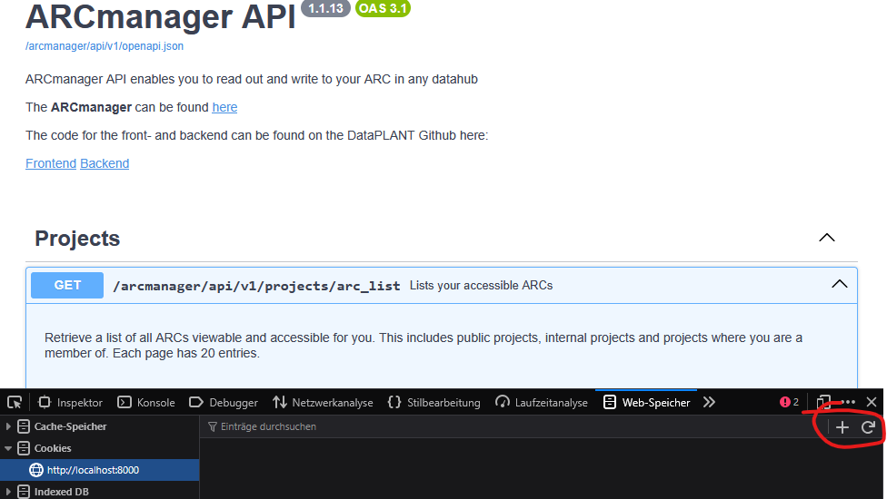
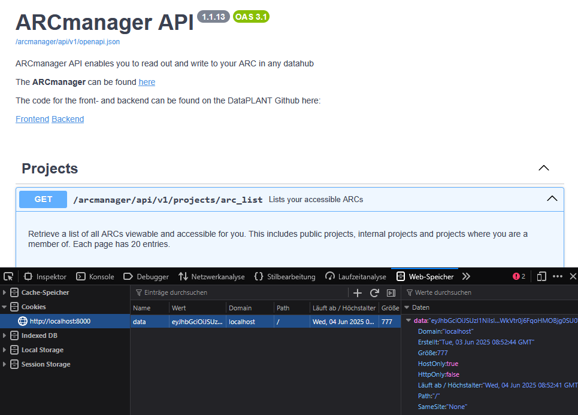

# How to retrieve the cookie data for the endpoints and validation

## Case 1: You have the frontend running locally

_Check first in the [authentication file](app/api/endpoints/authentication.py) if all the addresses are pointing towards the localhost address. Also check that for the appProperties.ts on the frontend side_

If you have the frontend running on localhost, just go ahead and login to a datahub of your choice.

After that your screen should look like something like that:

Press F12, go into the web storage tab and select the cookies area.
Here you should at least the cookies "data", "logged_in" and "username".
Go ahead and copy the string stored inside of "data".
This is the access token for gitlab and you can use it for all the requests of the backend.

Just go ahead and paste it inside of the "data" fields, if there are any.

## Case 2: You just have the backend running locally

Without the frontend locally you'll have to use the live frontend.

You make similar steps as in Case 1 on the [live site](https://nfdi4plants.de/arcmanager/app/index.html).

Get the string from "data", open up the backend documentation again and create a new cookie in the cookie section.

Name the cookie "data" and enter the copied string as value. This will simulate a login process as through the authentication.

Now you can use the documentation to test the various endpoints (you can fill out the cookie field with either a random string or with the proper cookie, as the cookie data will always be read out from the browser cookie area).
